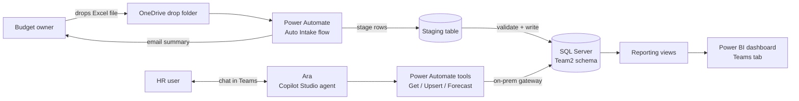

# HRD Cost Intelligence: SQL + Power Platform + AI Agent

An AI-enabled cost management system for the HR Department at Aramco Americas. It replaces manual, spreadsheet-based budget consolidation with a SQL Server database, an automated Excel intake pipeline, a Power BI dashboard, and a conversational agent ("Ara") that can answer budget questions, log changes safely, and forecast future years.

Built by team **Hire Standard** for the Aramco Americas **NextGen Capstone Initiative** (Summer 2026). 

> All data in this repository is synthetic dummy data created for the capstone. No real employee, financial, or company data is included.

---

## The problem

HR cost data lived in separate Excel workbooks per business unit, one tab per year and cost center. Getting a single answer (for example, "what were total controllable expenses for Recruiting in 2024?") meant opening several files and adding things up by hand. There was no history of who changed what, no consistent structure, and no forecasting.

## The solution



| Layer | What it does |
|---|---|
| **SQL Server** (`Team2` schema) | Star schema for 3 business units, 17 cost centers, 41 GL lines, 2022 to 2025 data. Views for reporting, stored procedures for every agent action, full audit log. |
| **Auto intake pipeline** | Drop an Excel file in OneDrive. Each row is staged, fuzzy-matched to existing cost centers and GL lines, validated, and written in one transaction. Bad rows are rejected with a reason, never guessed at. |
| **Ara (Copilot Studio)** | Answers budget questions, updates a single entry after showing the current value and getting explicit confirmation, and forecasts future years with a least-squares trend (always labeled as an estimate). |
| **Power BI + Teams** | Dashboard built on the reporting views, hosted in a Teams channel next to Ara so both live in one place. |

### Safety by design
- Agents never touch tables directly. Every action goes through a stored procedure.
- There is no delete path. The write procedure only inserts or updates, and only for cost centers and GL lines that already exist.
- Every write is recorded in `Team2.FactBudget_AuditLog` with the old value, new value, who, when, and which agent or flow made it.

---

## Repository layout

```
sql/                  Database: schema, seed data, views, procedures (run in order)
power-automate/       Build specs for the 3 agent tool flows and the intake flow
copilot-studio/       Ara's instructions, write-back guardrails, parameter descriptions
powerbi-and-teams/    Dashboard setup and Teams hosting guides
data/source/          Synthetic source workbook and raw system export
data/intake-tests/    Test files for the intake pipeline (sample, stress tests, 2027 demo)
docs/data-model.md    Table diagram and database design decisions
docs/presentation/    Final capstone presentation
```

## Database setup (SQL Server / SSMS)

Run against a database named `COSTANALYSER`, in this order:

| Step | Script | Creates |
|---|---|---|
| 1 | `sql/01_schema_and_seed.sql` | `Team2` schema, `BusinessUnit`, `CostCenter`, `GLDescription`, `FactBudget` + 2022 to 2025 data |
| 2 | `sql/02_agent_interface.sql` | `FactBudget_AuditLog`, `vw_BudgetDetail`, `vw_ControllableExpenseSummary`, `usp_GetBudget`, `usp_UpsertBudgetEntry`, `usp_GetControllableExpenseSummary` |
| 3 | `sql/03_intake_pipeline.sql` | `StagingBudgetImport`, `usp_StageBudgetRow`, `usp_ProcessStagingBatch`, `usp_GetStagingBatchSummary` |
| 4 | `sql/04_forecast_budget.sql` | `usp_ForecastBudget` (read-only) |

`usp_GetBudget` is built for conversational input: it matches business units by code or name ("HRS_CIG" or "HRS & CIG"), ignores commas, hyphens and `&` when matching names, and always returns a subtotal the user asks for by name even though subtotals are hidden when browsing broadly.

> Steps 1 to 3 drop and recreate their tables. Re-running them on a live database wipes that data.

Quick check after setup:
```sql
EXEC Team2.usp_GetBudget @BusinessUnitCode = 'SSD', @CostCenterName = 'Recruiting', @FiscalYear = 2024;
EXEC Team2.usp_ForecastBudget 'SSD', 'Recruiting', 'Total Labor', 'Actual', 2027;
```

## Power Platform components

The Power Automate flows, the Copilot Studio agent, and the Power BI report (`CCM_Dashboard`) were built inside the company's Microsoft tenant. Exports of those can't leave that environment, so this repo includes the full build specs used to create them instead:

- `power-automate/00_Integration_Overview.md` explains how the agent, flows, gateway, and database connect.
- The other files in `power-automate/`, `copilot-studio/`, and `powerbi-and-teams/` are step-by-step build guides, including the exact tool descriptions and agent instructions.
- `powerbi-and-teams/Embed_Agent_in_PowerBI_attempt.md` documents the first plan (chat embedded inside Power BI). It was blocked by tenant authentication settings, which led to hosting Ara and the dashboard together in Teams instead.

Connection details in the guides use `<SQL_SERVER>` as a placeholder.

## Test data

| File | Purpose |
|---|---|
| `HRD_Intake_Sample_2026.xlsx` | 7-row smoke test for the intake flow |
| `HRD_Intake_Test_2027.xlsx` | 4-row test across all 3 business units |
| `HRD_Intake_StressTest_2026.xlsx` | 99 rows: about 85 valid plus 14 deliberately broken rows (unknown cost centers or GL lines, invalid years, non-numeric amounts, bad value types, duplicates), one for every rejection path. See the matching ReadMe. |
| `HRD_Intake_2027_Budget_demo.xlsx` | Clean 697-row full-year budget used for the recorded demo |

## Team

**Hire Standard**: Aarti Khatri (co-captain, technical lead: SQL database, Power Automate flows and connections, Ara agent), Cody Kana, Victoria Decker, Samantha Blanco, Saud Almasoud, Matthew Gonzalez.

## Tech

SQL Server (T-SQL, SSMS) · Power Automate · On-premises data gateway · Microsoft Copilot Studio · Power BI · Microsoft Teams · OneDrive / Excel Online
