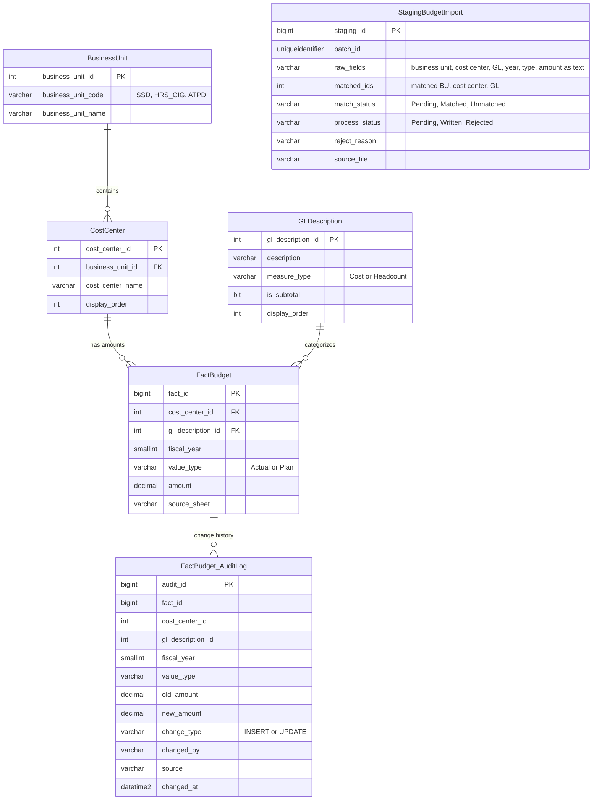

# Data Model

All objects live in the `Team2` schema of the `COSTANALYSER` database.

## Tables

| Table | Rows (seed) | Role |
|---|---|---|
| `BusinessUnit` | 3 | SSD, HRS & CIG, ATPD |
| `CostCenter` | 17 | Departments, each belonging to one business unit |
| `GLDescription` | 41 | Cost lines, subtotals (Total Labor, Total Controllable Expenses, ...) and headcount lines |
| `FactBudget` | ~3,400 | One amount per cost center, GL line, fiscal year, and value type (2022 to 2025) |
| `FactBudget_AuditLog` | 0 | Filled by every write from Ara or the intake pipeline |
| `StagingBudgetImport` | 0 | Landing zone for uploaded Excel rows before validation |

`FactBudget` has a unique key on (cost center, GL line, fiscal year, value type), so each cell in the original spreadsheets maps to exactly one row.

## Views

| View | Purpose |
|---|---|
| `vw_BudgetDetail` | Flat, readable join of all four core tables. Ara's lookups and Power BI read from this. |
| `vw_ControllableExpenseSummary` | One bottom-line figure (Total Controllable Expenses) per cost center and year, for dashboard summaries. |

## Stored procedures

| Procedure | Used by | Writes? |
|---|---|---|
| `usp_GetBudget` | Ara: questions | No |
| `usp_UpsertBudgetEntry` | Ara: single-entry updates | Insert or update, logged |
| `usp_ForecastBudget` | Ara: future-year estimates | No |
| `usp_GetControllableExpenseSummary` | Reporting | No |
| `usp_StageBudgetRow` | Intake flow, once per Excel row | Staging only |
| `usp_ProcessStagingBatch` | Intake flow, once per file | Insert or update, logged |
| `usp_GetStagingBatchSummary` | Checking a batch before or after processing | No |

## Design decisions

- **Star schema instead of the spreadsheet layout.** The source workbooks had one column per cost center per year. Normalizing into dimensions plus one fact table means a new year is just new rows, not new columns, and any combination can be filtered or summed with one query.
- **Nothing talks to tables directly.** Ara and the flows only call stored procedures, so every rule (validation, matching, logging) is enforced in one place, in the database, regardless of what the agent does.
- **No delete path.** The write procedures only insert or update. The worst case from a bad agent request is a wrong number, and the audit log keeps every old value, so any change can be reversed.
- **Existing dimensions only.** Writes never create a new cost center or GL line. An unrecognized name raises an error instead of being guessed at.
- **Stage, then validate, then write.** Uploaded files land in `StagingBudgetImport` as raw text first. Rows are matched and checked (unknown names, non-numeric amounts, invalid years or value types, duplicates within the file), rejected rows get a reason, and only clean rows are written, inside a single transaction.
- **Built for conversational input.** Lookups use partial matching, accept business unit names or codes, and ignore punctuation, because people don't type names exactly the way they are stored.
- **Forecasts are never saved.** `usp_ForecastBudget` fits a least-squares linear trend over the historical years for that exact combination, needs at least 2 years of data, and returns the real value instead if the year already has one.
